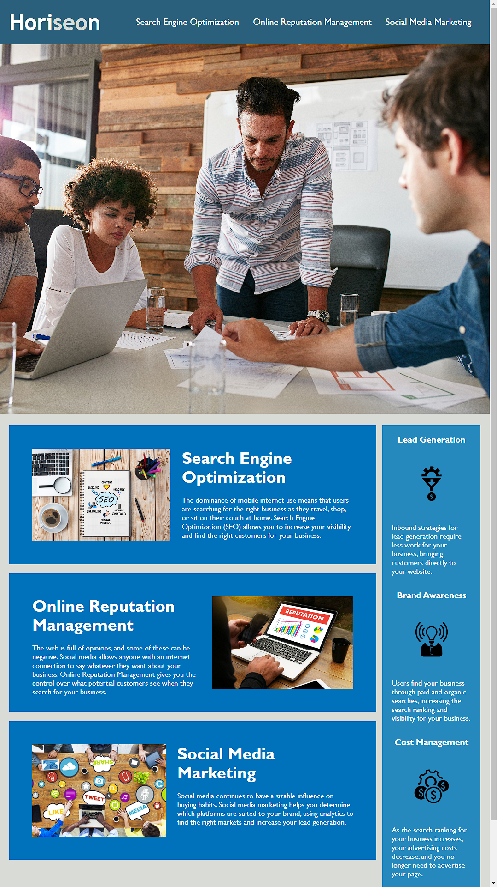

*Description*

This Marketing Agency on-the-job ticket was undertaken to take existing code and refactor it to make the agency website more accessible. 

The motivation is web accessibility - an increasingly important consideration for businesses. It ensures that people with disabilities can access a website using assistive technologies such as video captions, screen readers, and braille keyboards. 

Making a website accessible is also good for business for many reasons, one of them being that accessible sites are better positioned in search engines like Google. It also helps companies avoid litigation that can occur when people with disabilities cannot access their website.

The code was reviewed and refactored such that:

* Semantic HTML elements can be found throughout the source code
* HTML elements follow a logical structure independent of styling and positioning
* Image and icon elements contain accessible `alt` attributes
* Heading attributes fall in sequential order
* Title elements contain a concise, descriptive title

*Installation*

N/A

*Usage*

The project has been deployed via GitHub Pages and can be found:
https://peafunk3000.github.io/refactor-challenge/

The Repo for this project can be found:
https://github.com/PeaFunk3000/refactor-challenge

The scout rule was implemented such that code was left a little cleaner than as found. If the index.html or the style.css files are inspected, redacted entries can be found to indicate where code was changed to meet the job-ticket brief.

HTML elements nowfollow a logical structure and semantic elements were added, replacing the div elements found. Headings now fall in sequential order. Image and icon elements now contain accessible `alt` attributes. Title elements now contain a concise, descriptive title.

The CSS was reworked to make it more efficient by consolidating CSS selectors and properties, organizing them to follow the semantic structure of the HTML elements, and including comments before each element or section of the page.

*Credits*

Horiseon Social Solution Services, Inc
https://www.w3schools.com/html/html5_semantic_elements.asp
https://www.w3schools.com/tags/att_img_alt.asp

*License*
Please refer to the LICENSE in the repo.